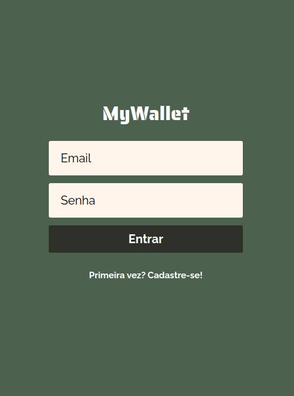

<h1 align="center">My Wallet</h1>

<h1 align="center">
  
</h1>

## 🔖 Sobre

Aplicação que simula uma carteira virtual, onde o usuário pode criar uma conta e então registrar suas transações financeiras e facilmente consultar seu saldo e histórico de entradas e saídas durante o mês.

## 🛠 Tecnologias utilizadas

O projeto foi desenvolvido usando as seguintes tecnologias:

- [ReactJS](https://reactjs.org)
- [Styled Components](https://styled-components.com/)
- [Axios](https://www.npmjs.com/package/axios)

## 📦 Como baixar o projeto

### Baixar o backend disponível em:

    https://github.com/samuelfcf/mywallet-backend

### Instalando o frontend

```bash

  # Clonar repositório
  $ git clone https://github.com/samuelfcf/mywallet-frontend

  # Entrar no diretório
  $ cd mywallet-frontend

  # Instalar dependências
  $ yarn install

  # Iniciar o projeto
  $ yarn start
```

---

Desenvolvido por Samuel Felipe Castro Fernandes
